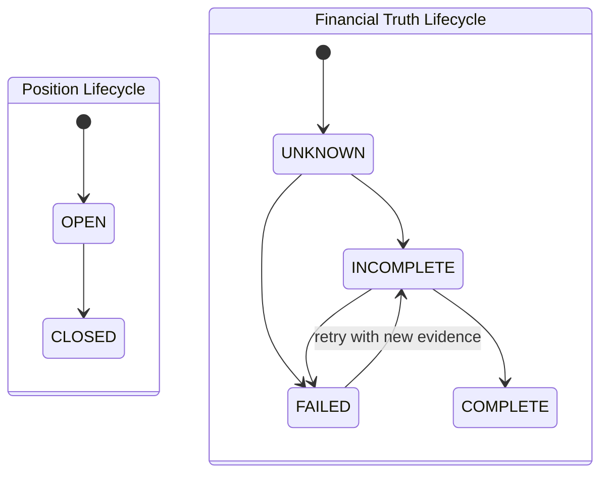

# Patch C1 — Canonical Financial Truth Foundation

## 1. Architecture summary

Patch C1 introduces an independent canonical Financial Truth lifecycle without
connecting it to trading or analytical runtime writers.

The foundation consists of:

- `canonical_financial_truth_v1`: one optional canonical record per position;
- `v_canonical_financial_truth_v1`: read-only projection combining current
  Position Lifecycle with independent Financial Truth Lifecycle;
- `common.financial_truth`: lifecycle types and pure completeness validation;
- `GET /financial-truth/positions/{position_id}`: unambiguous read contract.

A position without a canonical record is exposed as Financial Truth `UNKNOWN`.
Its authoritative values remain `null`. Estimates have separate fields and
never substitute for authoritative values.

There is intentionally no runtime writer, trigger, backfill, refresh job,
strategy integration, execution integration, ORC integration, Learning
integration, Replay integration, Warehouse integration, or FinalDecision
integration in C1.

## 2. Schema diff

New table: `canonical_financial_truth_v1`

| Field | Meaning |
|---|---|
| `position_id` | Stable one-to-one reference to `positions` |
| `financial_truth_status` | `UNKNOWN`, `INCOMPLETE`, `COMPLETE`, or `FAILED` |
| `executed_entry_qty` | Authoritative cumulative entry fill quantity |
| `executed_exit_qty` | Authoritative cumulative exit fill quantity |
| `remaining_qty` | Canonical economic quantity, independent of `positions.qty` |
| `authoritative_entry_fees_usdc` | Entry fee derived from authoritative evidence |
| `authoritative_exit_fees_usdc` | Exit fee derived from authoritative evidence |
| `authoritative_gross_pnl` | Authoritative gross PnL |
| `authoritative_net_pnl` | Authoritative net PnL |
| `estimated_gross_pnl` | Explicitly non-authoritative estimate |
| `estimated_net_pnl` | Explicitly non-authoritative estimate |
| `authoritative_source` | Identity of the future canonical writer/source |
| `authoritative_evidence` | Versioned evidence references/payload |
| `failure_reason` | Required when status is `FAILED` |
| timestamps/version | Evidence and schema provenance |

`COMPLETE` is rejected unless entry quantity, exit quantity, remaining
quantity, both fee legs, authoritative gross/net PnL, source, non-empty
evidence, and evidence observation time are all present.

New view: `v_canonical_financial_truth_v1`

- reads `positions.status` as `position_status`;
- independently reads canonical `financial_truth_status`;
- returns `UNKNOWN` when no canonical record exists;
- returns authoritative numeric fields as null when absent;
- calculates total authoritative fees only when both fee legs exist.

The migration contains no INSERT, UPDATE, DELETE, repair, backfill, trigger, or
historical recalculation.

## 3. Writer ownership map

| Canonical field | C1 owner | C1 runtime writer | Future ownership boundary |
|---|---|---:|---|
| `executed_entry_qty` | Canonical Financial Truth domain | None | `FINANCIAL_TRUTH_RECONCILER` only |
| `executed_exit_qty` | Canonical Financial Truth domain | None | `FINANCIAL_TRUTH_RECONCILER` only |
| `remaining_qty` | Canonical Financial Truth domain | None | `FINANCIAL_TRUTH_RECONCILER` only |
| `financial_truth_status` | Canonical Financial Truth domain | None | `FINANCIAL_TRUTH_RECONCILER` only |
| authoritative fees | Canonical Financial Truth domain | None | `FINANCIAL_TRUTH_RECONCILER` only |
| authoritative gross/net PnL | Canonical Financial Truth domain | None | `FINANCIAL_TRUTH_RECONCILER` only |
| estimated gross/net PnL | Estimation publisher | None | Separate estimate publisher; cannot write authoritative columns |
| `position_status` | Existing Position Lifecycle writers | Existing, unchanged | Remains owned by `positions`; never owns Financial Truth status |

C1 provides ownership boundaries and storage only. C2 must implement the sole
canonical writer with idempotent evidence high-water semantics.

## 4. Lifecycle diagram

There is no transition edge between the two state machines. Every combination
is structurally possible, including:

- Position OPEN + Financial Truth INCOMPLETE;
- Position CLOSED + Financial Truth UNKNOWN;
- Position CLOSED + Financial Truth INCOMPLETE.

Position CLOSED never causes Financial Truth COMPLETE.

## 5. API contract changes

New authenticated read endpoint:

`GET /financial-truth/positions/{position_id}`

The response explicitly includes:

- `position_status`;
- `financial_truth_status`;
- executed entry/exit and remaining quantities;
- separate entry, exit, and total authoritative fees;
- separate authoritative gross/net PnL;
- separate estimated gross/net PnL;
- evidence source, evidence payload, failure reason, version, and timestamps.

Contract rules:

- absent canonical evidence returns `UNKNOWN`, not COMPLETE;
- absent authoritative numbers return JSON `null`, not `0`;
- estimated values never populate authoritative fields;
- position absence returns 404;
- missing C1 schema returns 503;
- no existing API endpoint is changed.

## 6. Risk assessment

| Risk | C1 treatment | Residual action |
|---|---|---|
| Existing readers continue to use Position Lifecycle | No reader rewiring in foundation patch | C2+ staged consumer migration |
| Two financial authorities | C1 names one future canonical owner and adds no competing writer | Enforce grants and writer identity during C2 |
| Estimates mistaken for truth | Separate columns and API fields; COMPLETE constraint ignores estimates | Preserve naming in every future reader |
| UNKNOWN mistaken for zero | Authoritative fields remain null | Consumer contract tests in later patches |
| Historical phantom rows | No backfill or repair | Separate explicitly approved historical program |
| Migration order mismatch | Endpoint returns 503 when schema is absent | Apply schema before API validation in C2 plan |
| Numeric precision at HTTP boundary | Database remains NUMERIC; current API serializes to float consistently with existing API conventions | Consider decimal-string contract before external consumers adopt it |

Trading, execution, strategy, ORC, FinalDecision, Replay, Warehouse, Learning,
and runtime decision risks are bounded because C1 adds no call path from those
systems to the new model.

## 7. Test contract

Offline tests prove:

- Position OPEN does not imply Financial Truth UNKNOWN;
- Position CLOSED does not imply Financial Truth COMPLETE;
- all Position/Financial Truth lifecycle combinations remain independent;
- COMPLETE requires authoritative quantities, both fee legs, gross/net PnL,
  source and evidence;
- estimates remain separate when authoritative values are absent;
- the SQL COMPLETE constraint never references estimate fields;
- the view and endpoint never coalesce authoritative PnL to zero;
- the migration has no backfill, mutation statement against the new table,
  or runtime trigger.

## 8. Migration plan for Patch C2

C2 is not implemented here. Its proposed local-validation sequence is:

1. capture pre-migration schema and runtime evidence;
2. apply the C1 schema migration to LOCAL PAPER only;
3. validate idempotent second application and catalog constraints;
4. validate the new API contract with no canonical rows (`UNKNOWN`, null
   authoritative values);
5. implement the sole `FINANCIAL_TRUTH_RECONCILER` behind a disabled flag;
6. ingest only new post-activation evidence; no historical rows;
7. prove idempotency, late fill/fee handling, account-scoped identity and
   COMPLETE gating in LOCAL PAPER;
8. repeat controlled validation in LOCAL LIVE only after separate approval;
9. do not rewire ORC, Learning, Replay, Warehouse, UI decisions, or repair
   history as part of C2 foundation-writer validation.

Patch C1 stops before every C2 action.
